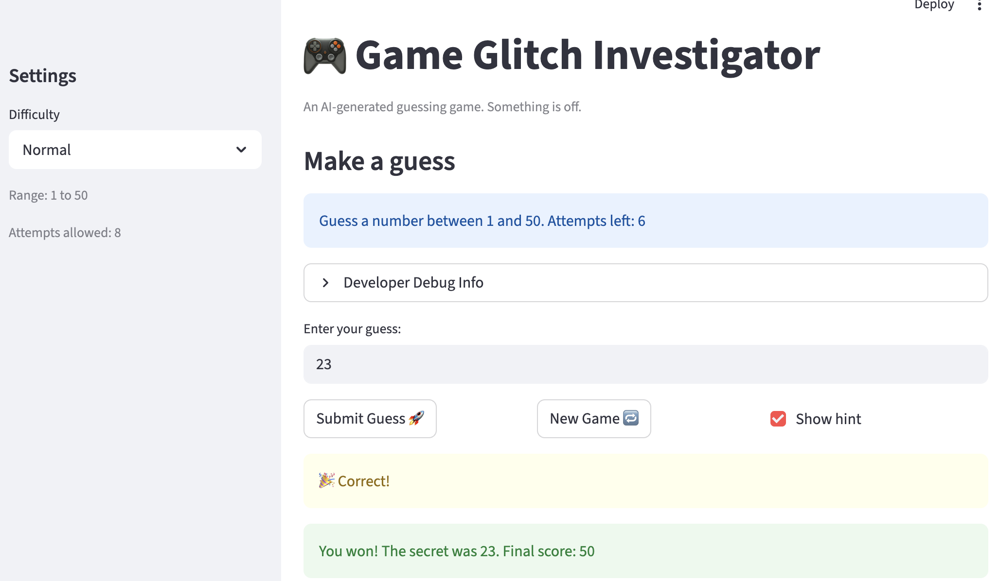
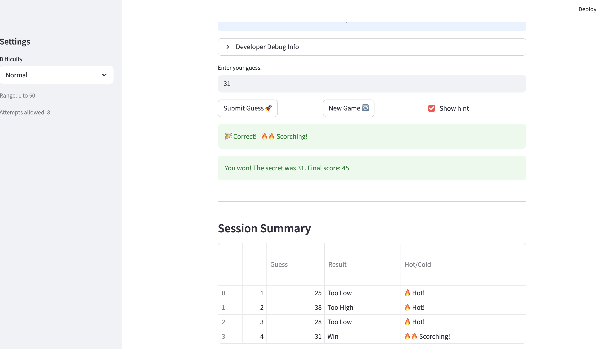

# 🎮 Game Glitch Investigator: The Impossible Guesser

## 🚨 The Situation

You asked an AI to build a simple "Number Guessing Game" using Streamlit.
It wrote the code, ran away, and now the game is unplayable. 

- You can't win.
- The hints lie to you.
- The secret number seems to have commitment issues.

## 🛠️ Setup

1. Install dependencies: `pip install -r requirements.txt`
2. Run the broken app: `python -m streamlit run app.py`

## 🕵️‍♂️ Your Mission

1. **Play the game.** Open the "Developer Debug Info" tab in the app to see the secret number. Try to win.
2. **Find the State Bug.** Why does the secret number change every time you click "Submit"? Ask ChatGPT: *"How do I keep a variable from resetting in Streamlit when I click a button?"*
3. **Fix the Logic.** The hints ("Higher/Lower") are wrong. Fix them.
4. **Refactor & Test.** - Move the logic into `logic_utils.py`.
   - Run `pytest` in your terminal.
   - Keep fixing until all tests pass!

## 📝 Document Your Experience

- [ ] Describe the game's purpose.
Glitchy Guesser is a number guessing game where the player tries to identify a randomly chosen secret number within a limited number of attempts. After each guess, the game gives directional feedback ("Too High" / "Too Low") along with a Hot/Cold proximity indicator showing how close the guess was. The player earns points for winning, with fewer attempts yielding a higher score.

The twist — reflected in the name "Game Glitch Investigator" — is that the original AI-generated code contained intentional bugs (like wrong difficulty ranges, broken score resets, and incorrect type comparisons) for players or developers to find and fix.

- [ ] Detail which bugs you found.
I mainly found the following five bugs
1) Difficulty settings for “Hard” and “Normal” are reversed. 
The difficulty configuration for Hard and Normal appears to be incorrect. Currently, Normal is more difficult than Hard:
Normal: Range 1–100, Attempts allowed: 8
Hard: Range 1–50, Attempts allowed: 5
Because the range for Normal is larger, it is actually harder than Hard.

2) The hints were backwards. 
The hint messages appear to be displayed incorrectly.
When the guessed number is lower than the secret number, the game should display “Go higher”, but it currently shows “Go LOWER.”
When the guessed number is higher than the secret number, the game should display “Go lower”, but it currently shows “Go HIGHER.”
The hint logic appears to be reversed.

3) Attempt counter starts with the wrong value.
The Attempts counter is initialized at 1 instead of 0 at the start of the game.
As a result, the Attempts left value is always one less than expected, and the game ends and displays the result one attempt earlier than it should.

4) Secret number may be generated outside the selected range.
The secret number is sometimes generated outside the selected difficulty range.
For example, when selecting a difficulty with Range 1–20 or Range 1–50, the secret number is still sometimes generated from 1–100.

5) The result of the comparison between the guess number and the secrect number are wrong sometimes.
The bug was in app.py: On even-numbered attempts, secret is cast to a str. Then in check_guess, comparing int > str raises a TypeError, which falls into the except block that does string comparison — so "12" > "5" is False lexicographically (because "1" < "5"), returning "Too Low" even though 12 > 5. 

- [ ] Explain what fixes you applied.
With the help of Claude Code, I: 
1) Swaped the range settings so that Hard uses 1–100 and Normal uses 1–50.
2) Swaped the hits of “Go LOWER” and “Go HIGHER”.
3) Set the initial Attempts counter at 0 when the game begins.
4) Generated the secret number within the selected range for the chosen difficulty level.
5) Always pass secret as an int, so check_guess always does a numeric > / < comparison.

## 📸 Demo

- [ ] [Insert a screenshot of your fixed, winning game here]

## 🚀 Stretch Features

- [ ] [If you choose to complete Challenge 4, insert a screenshot of your Enhanced Game UI here]

